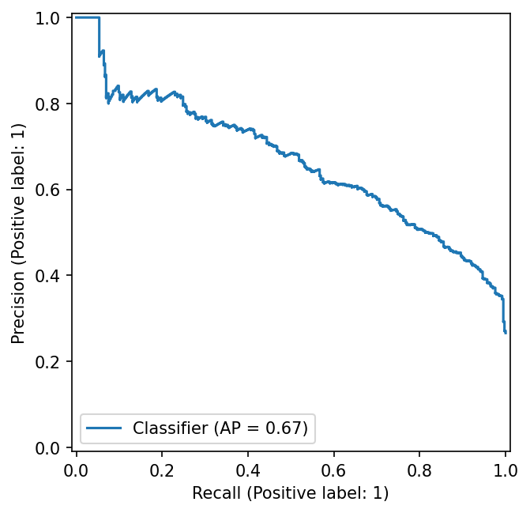
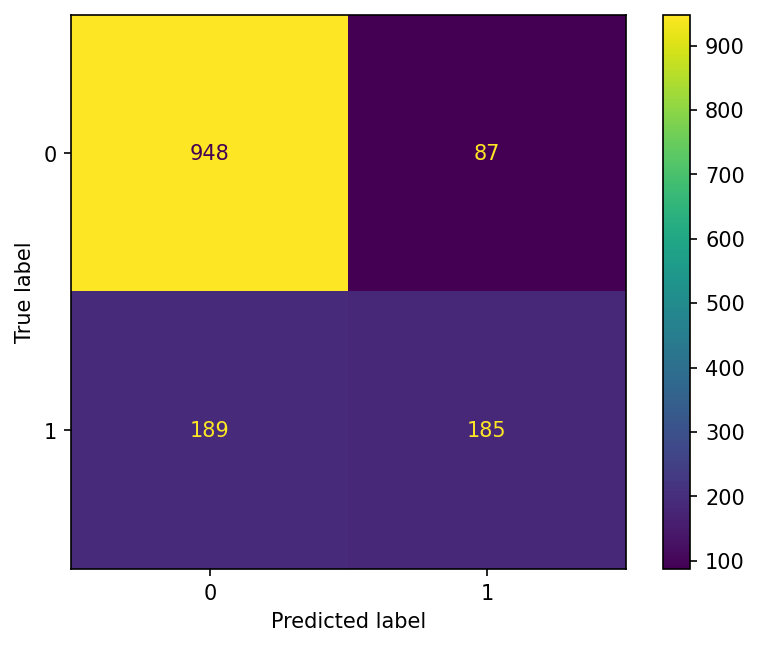

# Customer Retention Pipeline

A public-data portfolio project that turns customer-churn exploration into a
tested training and batch-scoring workflow. The goal is to rank customers for
human retention review under an **illustrative 20% outreach capacity**, not to
claim that high-risk customers can actually be retained.

The IBM Telco sample contains 7,043 customer records and 1,869 recorded churn
labels (26.54%). One row represents one customer in a snapshot. There are no
usable longitudinal cutoff/outcome timestamps, so this is a snapshot
classification demo, not a validated forward-looking 90-day forecast.

## Main result

All models use the same five stratified folds within the 5,634-row training
partition. The other 1,409 customers are held out. Imputation, encoding and
scaling are fitted inside each fold. AP means average precision, not accuracy
or trapezoidal PR area. Standard deviations are across folds, not confidence
intervals.

| Model | CV AP, mean ± SD | CV ROC AUC | CV recall at 0.5 | CV accuracy at 0.5 |
|---|---:|---:|---:|---:|
| Dummy (class prior) | 0.2654 ± 0.0001 | 0.5000 | 0.0000 | 0.7346 |
| Logistic Regression | 0.6614 ± 0.0216 | 0.8461 | 0.5431 | 0.8026 |
| XGBoost (`B_shallow`) | 0.6701 ± 0.0216 | 0.8493 | 0.5331 | 0.8056 |

XGBoost has a modest AP advantage of **0.0087** over Logistic Regression,
positive on all five paired folds. It was selected from six small, fixed
XGBoost candidates. This is not a statistical significance claim, and using
the same folds for selection makes the winning CV score optimistic.

The training out-of-fold scores set the threshold to
`0.517093300819397`, selecting 1,126 of 5,634 customers (19.99%). The threshold
was frozen before final holdout evaluation.

| Final holdout result | Value |
|---|---:|
| Average precision / ROC AUC | 0.6662 / 0.8469 |
| Precision / recall | 68.01% / 49.47% |
| F1 / accuracy | 0.5728 / 80.41% |
| Selected for review | 272 / 1,409 (19.30%) |
| True positives / false positives | 185 / 87 |
| False negatives / true negatives | 189 / 948 |

Business reading: the candidate list contains 185 recorded churners and 87
non-churners, while 189 churners are missed. A lower threshold generally
increases coverage and workload. A fixed threshold does **not** guarantee a
20% selection rate on future batches. No retention conversion, cost saving or
ROI has been measured. Details: [model card](reports/model_card.md).





The committed figures and [reference metrics](reports/reference/test_metrics.json) come from the verified frozen run.

## Run locally

Use Python 3.10 for the reference environment; commands below run from the
repository root. Start with a new virtual environment. The constraints pin
reference numerical/plotting/test dependencies, but are not a full lockfile.

```bash
python3.10 -m venv .venv
source .venv/bin/activate
python -m pip install --upgrade pip
python -m pip install -c constraints-py310.txt -e ".[dev]"
python -m pip check
python -m pytest -q
```

On Windows use `.venv\Scripts\activate` instead. XGBoost may need an OpenMP
runtime on macOS; consult its [official installation guide](https://xgboost.readthedocs.io/en/stable/install.html)
if import reports a missing `libomp` library.

Obtain the source CSV and verify its checksum using [data instructions](data/README.md).
The raw data is deliberately not bundled. Then reproduce the frozen experiment:

```bash
python -m churn_pipeline.train \
  --input data/raw/customer_churn.csv \
  --output-dir runs/demo-01

python -m churn_pipeline.predict \
  --input data/raw/customer_churn.csv \
  --output runs/demo-01/all_customers_scored.csv \
  --model runs/demo-01/artifacts/churn_pipeline.joblib \
  --metadata runs/demo-01/artifacts/model_metadata.json
```

Use a **new** output directory for every training run. Do not omit
`--output-dir`: the default is the project root, whose existing `reports/`
documentation is intentionally protected from overwrite. If a run fails after
creating partial files, use another empty run directory after diagnosing it.

The prediction command above is an interface smoke test, **not** a new
generalization evaluation: the CSV includes training customers. `Churn`, when
present, is ignored for scoring. For a new batch, provide one row per customer
with unique nonblank `customerID` and all 19 raw feature columns from
[`config.py`](src/churn_pipeline/config.py); do not include an outcome label.
Numeric blanks are imputed, malformed numeric strings are rejected, and
unseen categories are encoded without failing. Extra columns are not features.

Outputs preserve input row order and contain four columns:

```text
customerID,churn_probability,predicted_class,risk_tier
demo-customer-A,0.79,1,High
demo-customer-B,0.08,0,Standard
```

These two rows are **illustrative**, not measured customer predictions.
`predicted_class=1` and `High` mean score ≥ the saved threshold; `Standard`
does not mean no risk. Scores have not been calibrated as real-world event
probabilities. Existing output files are rejected unless `--overwrite` is
explicitly supplied. Never load an untrusted joblib model: integrity hashes
detect mismatches, not malicious artifacts. Training and scoring must use the
same exact runtime versions recorded in metadata, including Python's patch
version; retrain in the destination environment rather than bypass the check.

## What is produced

```text
raw CSV → validation + feature whitelist → split + fold-fitted preprocessing
        → Dummy / Logistic / XGBoost comparison → training OOF threshold
        → training-only final fit → holdout evaluation → saved pipeline
new CSV → same feature preparation + saved pipeline → risk-review CSV
```

- `src/churn_pipeline/`: schema, preparation, preprocessing, models, metrics,
  training and batch prediction.
- `tests/`: synthetic-data tests, including a subprocess prediction CLI test;
  tests do not download the dataset.
- `notebooks/`: audit, EDA and modeling exploration; source learning drafts are
  retained in the local project. Public presentation copies keep executable
  code and final explanations, with saved outputs and local metadata cleared.
- `reports/model_card.md`: use boundaries and experimental evidence.
- `docs/bank_transfer_design.md`: separate hypothetical bank requirements.
- `.github/workflows/ci.yml`: install, dependency check, tests and CLI help on
  pushes/pull requests. Full training and notebook execution are separate
  acceptance checks. A workflow file is not evidence of a green remote run.
- `runs/demo-01/` (local only): fitted pipeline + metadata; comparison and
  threshold tables; OOF/holdout metrics; holdout prediction CSV; PR, ROC,
  confusion-matrix and threshold figures; global/local TreeSHAP figures.

SHAP contributions are computed by XGBoost and plotted with `shap`, on a
reproducible sample of up to 200 training rows. Values are in raw log-odds, not
percentage-point changes in churn probability. They explain model behavior,
not causes or intervention effects.

## Bank internship connection

My fintech/data-team internship involved translating internal work orders
into SQL extractions, checking customer/transaction field definitions and
grain, and coordinating requirements across business departments. This
independent project applies that requirements-to-data discipline to a public
Telco demo. It did **not** use bank data or build/deploy a churn model during
the internship. The [bank-transfer design](docs/bank_transfer_design.md)
describes what would have to change before any banking application.

## Limitations and publication status

Earlier EDA used the full dataset, so the holdout is not completely untouched
at the analyst level. No temporal validation, calibrated risk, subgroup
fairness validation or intervention experiment has been established. The
pipeline reproduces one frozen dataset/experiment: it intentionally rejects a
different data hash, selected candidate or reproduced threshold, rather than
silently tuning a different model.

Local learning guides, agent instructions, backups, raw data, generated
customer lists and model binaries are excluded by `.gitignore`. This does not
remove already tracked files or certify that remaining content is public-safe.
See the [release checklist](docs/release_checklist.md) for reproduction and learning checkpoints.
No remote deployment or verified business return is claimed.
